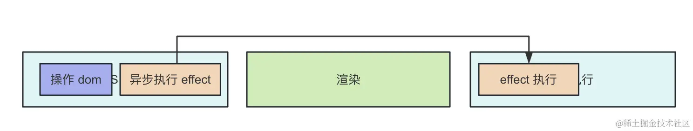

# 常用Hook

### useState

如果和渲染绑定，必须改变引用地址才能页面重绘，js变化但是页面没有

useState的setXX 方法是异步的，

可以和 `immer` 结合使用

- 如果你传递一个对象作为 `nextState`，它将浅层合并到 `state` 中。
- 如果你传递一个函数作为 `nextState`，它将被视为 **更新函数**。它必须是个纯函数，应该以已加载的 state 和 props 作为参数，并且应该返回要浅层合并到 `state` 中的对象。React 会将你的更新函数放入队列中并重新渲染你的组件。在下一次渲染期间，React 将通过应用队列中的所有的更新函数来计算下一个 state。

```jsx

// nextState：一个对象或者函数。
/* 第一个参数为object类型 */
setState({ number:1 })
/* 第一个参数为function类型 */
setState((state,props)=>{
 // state 取到最新的值
    return { number:1 } 
})
// 第二个参数，仅在类组件支持，hook内不支持第二个参数；hook内可通过useEffect
// 可选的 callback：如果你指定该函数，React 将在提交更新后调用你提供的 callback。

setState(nextState, callback?)
```

**注意**

1.只要调用了setState就会重新渲染

### useEfffect

监听[]或者常量，都只会渲染一次。如果你发现又多次，请关闭严格模式

```jsx
  // <React.StrictMode>
    <App />
  // </React.StrictMode>
```

也可以不填

```jsx
 useEffect(() => {
    console.log('xxx')
  });
```

监听为空表示，只有有变化（任何）,都会重新执行

**副作用清理**

页面初始化和页面卸载

通过return () => { }; 来执行副作用清楚

```jsx
 useEffect(() => {
    window.addEventListener('resize', handleEvent); // 添加事件监听器
    return () => {
      window.removeEventListener('resize', handleEvent); // 清理事件监听器
    };
  }, []); 
 
```

监听num，每次num变化执行限制性副作用清除，再执行XXXX

```jsx
useEffect(() => {
   XXXX
    return () => {
   BBBB
    };
  }, [num]);
```

[关于取消请求](https://www.notion.so/175314c0684680e0a75cc8eaffb956cb?pvs=21)

```jsx
useEffect(() => {
	const abortController = new AbortController();
   XXXX
    return () => {
		   abortController.abort()
    };
  }, [num]);
```

### **effect**

js 执行和渲染是阻塞的

**useEffect  处理逻辑是采用异步调用，放入任务队列，等到主线程任务完成，DOM 更新，js 执行完成，视图绘制完毕，才执行。所以 effect 回调函数不会阻塞浏览器绘制视图。
单独的宏任务或者微任务太多，可能发生问题 闪屏**

useEffect 的 effect 函数会在操作 dom 之后异步执行，**执行和渲染交叉进行**



**useLayoutEffect**  如果闪屏比较严重，用**useLayoutEffect**

同步的，在渲染之前执行，不会闪屏，但是超过 50ms 的任务就被称作长任务，会阻塞渲染，导致掉帧。一般说effect还是异步的好。（执行时未渲染无法获取dom）


**Q:**

如果在 useLayoutEffect 使用 CSS-in-JS 会造成哪里问题呢？

- 首先 useLayoutEffect 执行的时机 DOM 已经更新完成，布局也已经确定了，剩下的就是交给浏览器绘制就行了。
- 如果在 useLayoutEffect 动态生成 style 标签，那么会再次影响布局，导致浏览器再次重回和重排。

### **useReducer**

前面用的 setState 都是直接修改值，那如果在修改值之前需要执行一些固定的逻辑呢？

这时候就要用 useReducer 了

参数 三个

**`reducer`**

**`initialState`**

**`init?` 这是一个可选的初始化函数，用于计算初始状态。它在组件首次渲染时调用，返回的值将作为初始状态。**

直接看使用

```jsx
import { useReducer } from 'react'
  
const [res, dispatch] = useReducer(reducer, { result: 0});
  
 function reducer(state, action) {
   console.log(state, action)
   // state { result: 0}
   // action {type: 'add', num: 1}
   switch (action.type) {
     case 'add':
       return {
         result: state.result + action.num
       }
     case 'minus':
       return {
         result: state.result - action.num
       }
   }
   return state;
 }
 
 
  <div onClick={() => dispatch({type: 'add', num: 1})}>加</div>
  <div onClick={() => dispatch({type: 'minus', num: 1})}>减</div>
  <div>{JSON.stringify(res)}</div>
```

可以和 `immer` 结合使用

### useRef

保存 dom 引用呢？

```jsx
import { useEffect, useRef } from "react";

...

  const inputRef = useRef<HTMLInputElement>(null);
  // 页面挂载时聚焦
   useEffect(() => {
        inputRef.current?.focus();
    },[]);
    
  return (
        <div>
            <input ref={inputRef}></input>
        </div>
    );
    
    ...
```

也可以放别的内容，js值改变，但是不会触发重新渲染

```jsx
const numRef = useRef<number>(0);
...
    <div>
        <div onClick={() => {
            numRef.current += 1
        }}>{numRef.current}</div>
    </div>
 ...
```

想触发渲染，还是得配合 state

```jsx
import { useState, useRef } from "react";
const [,forceRender] = useState(0) 
const numRef = useRef<number>(0);
...
    <div>
    {/*这里 */}
        <div onClick={() => {
            numRef.current += 1
            forceRender(Math.random())  // 只要调用了setState就会重新渲染 
        }}>{numRef.current}</div>
    </div>
 ...
```

不过一般不这么用，如果想改变内容会触发重新渲染，直接用 useState 或者 useReducer 就可以了。

useRef 一般是用来存一些不是用于渲染的内容的。

单个组件内如何拿到 ref 我们知道了，那如果是想把 ref 从子组件传递到父组件呢？

这种有专门的 api： forwardRef。

### **forwardRef + useImperativeHandle**

**forwardRef  ref（dom元素传递）**

如果是想从子组件传递 ref 到父组件，就需要 forwardRef 了，也就是把组件内的 ref 转发一下。

```jsx
// 一个简单的输入组件，使用 forwardRef
const Input = forwardRef((props, ref) => {
  return <input ref={ref} {...props} />;
});

// 父组件
const Parent = () => {
  const inputRef = React.useRef(null);

  const focusInput = () => {
    if (inputRef.current) {
      inputRef.current.focus();
    }
  };

  return (
    <div>
      <h1>ForwardRef Example</h1>
      <Input ref={inputRef} placeholder="Type something..." />
      <button onClick={focusInput}>Focus the input</button>
    </div>
  );
};

```

ref支持自定义的

`forwardRef` 通常只支持转发一个 `ref` 到子组件。如果你需要在一个组件中处理多个 `ref`   refs

```jsx
const MultiRefInput = forwardRef((props, refs) => {
  return (
    <div>
      <input ref={refs.inputRef} placeholder="Input 1" />
      <input ref={refs.secondInputRef} placeholder="Input 2" />
    </div>
  );
});

const Parent = () => {
  const refs = {
    inputRef: useRef(null),
    secondInputRef: useRef(null),
  };

  const focusInput1 = () => {
    if (refs.inputRef.current) {
      refs.inputRef.current.focus();
    }
  };

  const focusInput2 = () => {
    if (refs.secondInputRef.current) {
      refs.secondInputRef.current.focus();
    }
  };

  return (
    <div>
      <h1>Multiple Refs Example</h1>
      <MultiRefInput refs={refs} />
      <button onClick={focusInput1}>Focus Input 1</button>
      <button onClick={focusInput2}>Focus Input 2</button>
    </div>
  );
};
```

**`forwardRef` 的参数**

**`props`**

`ref`   是转发的引用，允许父组件访问子组件的 DOM 元素或组件实例(类组件能拿到，函数组件拿不到，可用`useImperativeHandle` 来暴露特定的方法或属性)。

```jsx
MultiRefInput.displayName = 'blockCard'
```

添加静态方法（例如 displayName）

当使用 `forwardRef` 创建组件时，可以为该组件指定静态属性，例如 `displayName`。`displayName` 属性能够帮助在 React 开发工具或调试器中更好地标识组件，提高可读性。

**useImperativeHandle**

它有 3 个参数，第一个是传入的 ref，第二个是是返回新的 ref 值的函数，第三个是依赖数组。

```jsx
// 子组件中
const ChildrenBlock = forwardRef((props, ref) => {
  const inputRef = useRef(null);

  useImperativeHandle(ref, () => {
    return {
      aaa() { // 调用内部方法属性等
        inputRef.current?.focus();
      }
    }
  }, [inputRef]);

  return <div>
    <input ref={inputRef}></input>
  </div>
})

 // 父组件中
 function App() {
  const ref = useRef(null);
 
  useEffect(()=> {
    console.log('ref', ref.current)
    ref.current?.aaa(); // 这样调用 ()
  }, []);

  return (
    <div className="App">
      <ChildrenBlock ref={ref}/>
    </div>
  );
}
```

也就是说用 useImperativeHanlde 自定义了 ref 对象

### **useContext**

跨任意层组件传递数据，我们一般用 Context。(类似vue inject,provide)


```jsx

const contextTest = createContext()

function a(){
	return <contentTest.provider  value={{name:'hello',getV:'22'}}>
			<childernItem></childernItem>
		</contentTest.provider>
}

//  childernItem

const getVal = useContext(contentTest)
```

在单独文件创建上下文

```jsx
 // Context 文件
// 创建上下文
export const contextTest = createContext();

```

去其他组件消费

```jsx
import { contextTest } from './Context'; // 导入上下文
```

配置数据基本都是用 Context 传递。

如果你有多个不相关或功能不同的状态（例如，用户认证、主题设置、购物车状态等），则应该考虑使用多个上下文。这样可以避免上下文更新导致的性能问题，因为当一个上下文改变时，所有消费这个上下文的组件都会重新渲染。

### **memo + useMemo + useCallback**

**memo ： memo 的作用是只有 props 变的时候，才会重新渲染被包裹的组件。**

```jsx
import { memo, useEffect, useState } from "react";

function Aaa() {
  const [,setNum] = useState(1);
  console.log('AAAA  render')

  useEffect(() => {
    setInterval(()=> {
      setNum(Math.random());
    }, 2000)
    console.log('AAAA useEffect ')
  },[]);

  return <div>
    <Bbb count={2}></Bbb>
  </div>
}

function Bbb(props) {
  console.log('bbb render');

  useEffect(() => {

    console.log('bbb useEffect ')
  },[]);

  return <h2>{props.count}</h2>
}

export default Aaa;
```


在 Aaa 里面不断 setState 触发重新渲染

每次都会触发Aaa 和 Bbb 组件的重新渲染。

但很明显，Aaa中值改变，重新渲染而对于Bbb则不需要再次渲染。

加上 memo

memo 的作用是只有 props 变的时候，才会重新渲染被包裹的组件。

```jsx
  // Aaa
  return <div>
    <MemoB count={2}></MemoB>
  </div>

const MemoB = memo(Bbb)
```

用 memo 的话，一般还会结合两个 hook：useMemo 和 useCallback。

**memo 是防止 props 没变时的重新渲染，useMemo 和 useCallback 是防止 props 的不必要变化。**

```jsx

 // Aaa
 
 cosnt fn = ()=>{}
  return <div>
    <MemoB fn ={fn }></MemoB>
  </div>
```

即使B组件用memo包裹，但是还是会setInterval频率一样的重复渲染，因为每次创建方法的时候都是新创建的，也就是每次 props 都会变，这样 memo 就没用了。

**`useCallback`**

useCallback(()=>{},[]); 跟effect类似只有依赖改变才会渲染重新

```jsx
const fn = useCallback(()=>{},[]);
  return <div>
    <MemoB  fn={fn}></MemoB>
  </div>
}
```

**`useMemo`**   

对于**对象或数组的 props，对于｛a:1｝可能对象引用地址改变但是a的值没有变化，此时不应该重新渲染Bbb，可用`useMemo`   缓存结果来优化这个**

同理，useMemo 也是和 memo 打配合的，只不过它保存的不是函数，而是值：

所以说，**如果子组件用了 memo，那给它传递的对象、函数类的 props 就需要用 useMemo、useCallback 包裹，否则，每次 props 都会变，memo 就没用了。**

**反之，如果 props 使用 useMemo、useCallback，但是子组件没有被 memo 包裹，那也没意义，因为不管 props 变没变都会重新渲染，只是做了无用功。**

memo + useCallback、useMemo 是搭配着来的，少了任何一方，都会使优化失效。

**但 useMemo 和 useCallback 也不只是配合 memo 用的：**

比如有个值的计算，需要很大的计算量，你不想每次都算，这时候也可以用 useMemo 来缓存。

```jsx
  // 这样 data的值没有变，但是应用地址改变了
const [data, setData] = useState({ value: 10 });

 return <div>
    <div onClick={() => setData({ value: 10 })}>setData</div>
    <MemoB count={ count2 } ></MemoB>
  </div>
```

这样改变引用值，Bbb 也不会重新渲染（reload 也不会打印和vue computed 缓存类似）

```jsx
  const count2 = useMemo(() => {
	  console.log('reload')
    return {value: data.value}
  }, [data.value]);
  
   return <div>
    <div onClick={() => setData({ value: 10 })}>setData</div>
    <MemoB count={ count2 } ></MemoB>
  </div>
```

react 的 主要的 hook 为这些
